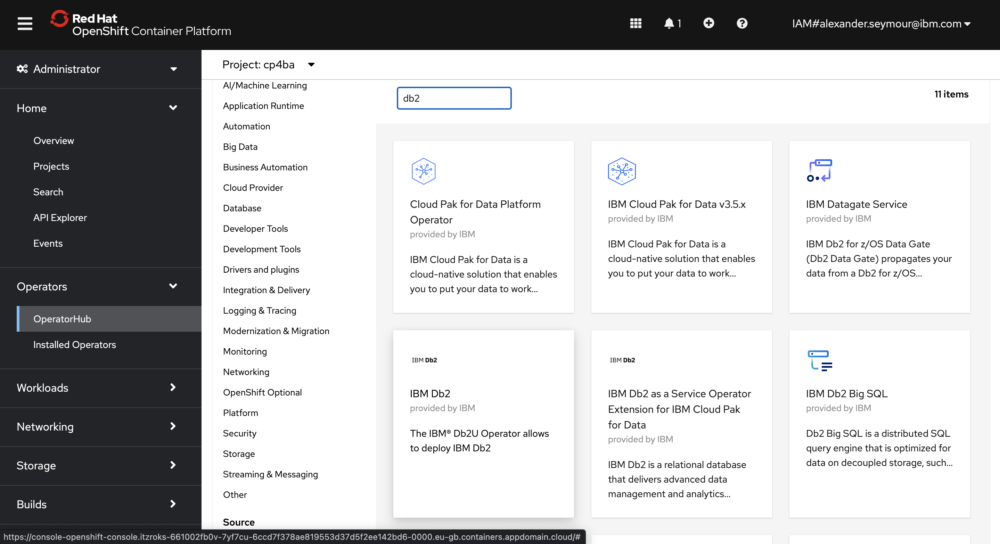
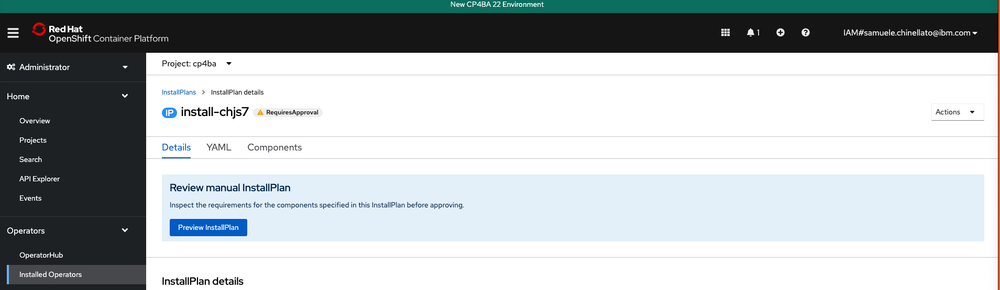

# Installing the CP4BA Content Operator on Openshift

## Description

In this guide we will install the CP4BA Operator with DB2 and OpenLDAP instances.

Relevant IBM cloud docs:

- [Console Installing Capabilities in Red Hat Openshift](https://www.ibm.com/docs/en/cloud-paks/cp-biz-automation/22.0.1?topic=console-installing-capabilities-in-red-hat-openshift)
- [Deployment Preparing Client Connect Cluster](https://www.ibm.com/docs/en/cloud-paks/cp-biz-automation/22.0.1?topic=deployment-preparing-client-connect-cluster)

## Contents

- [Installing the CP4BA Content Operator on Openshift](#installing-the-cp4ba-content-operator-on-openshift)
  - [Description](#description)
  - [Contents](#contents)
  - [Prerequisites](#prerequisites)
  - [Guide](#guide)
    - [Configuring Openshift Cluster](#configuring-openshift-cluster)
      - [Logging into the Cluster from CLI](#logging-into-the-cluster-from-cli)
      - [Creating the required projects](#creating-the-required-projects)
      - [Extending the Openshift catalog](#extending-the-openshift-catalog)
      - [Retrieving your IBM entitlement key](#retrieving-your-ibm-entitlement-key)
      - [Adding your IBM entitlement key](#adding-your-ibm-entitlement-key)
      - [Creating the prerequisite secrets.](#creating-the-prerequisite-secrets)
    - [Deploying DB2](#deploying-db2)
      - [Deploying the operator](#deploying-the-operator)
      - [Applying norootsquash daemonset](#applying-norootsquash-daemonset)
      - [Applying DB2 custom resource](#applying-db2-custom-resource)
      - [Creating DB2 databases](#creating-db2-databases)
    - [Deploying LDAP](#deploying-ldap)
    - [Deploying CP4BA](#deploying-cp4ba)
      - [Installing the CP4BA Operator](#installing-the-cp4ba-operator)
      - [Approving installs the CP4BA Operator](#approving-installs-the-cp4ba-operator)
      - [Verifying install status of operators](#verifying-install-status-of-operators)
  - [Contact](#contact)

## Prerequisites

**Openshift Cluster**

- 5 nodes
- 16vCPU
- 2TB NFS Size
- Version 4.9

**Command Line Tools**

- Openshift Client CLI
- IBM Cloud CLI

## Guide

> **The following steps in this guide assume that you have navigated to the `1-cp4ba-install` directory within this repo (the same directory this readme file is located).**

### Configuring Openshift Cluster

#### Logging into the Cluster from CLI

1. Go to the IAM section in the top right corner of the UI, and select _Copy login command_.


2. Paste the command in your terminal and hit enter.


3. The command `oc whoami` will tell you how you're logged in.

#### Creating the required projects

1. Create a `cp4ba` project.

```
oc new-project cp4ba
```

2. Create a `db2` project.

```
oc new-project db2
```

3. Create a `openldap` project.

```
oc new-project openldap
```

#### Extending the Openshift catalog

To access the CP4BA operator you will need to extend the Openshift catalog.

1. Extend the Openshift catalog.

```bash
oc apply -f ./cp4ba/catalogsources.yaml
```

#### Retrieving your IBM entitlement key

To pull images from the protected cp.icr.io registry you will require an IBM entitlement key.

1. Log in to [MyIBM Container Software Library](https://myibm.ibm.com/products-services/containerlibrary) with the IBMid and password that is associated with the entitled software.
2. In the Container software library tile, verify your entitlement on the _View library_ page, and then go to _Get entitlement key_ to retrieve the key.

#### Adding your IBM entitlement key

To successfully pull the DB2 image from the protected registry you must add a secret containing your entitlement key.

1. Export the entitlement key to your terminal.

```
export ENTITLEMENT_KEY=<entitlement_key>
```

2. Export your email address to your terminal.

```
export EMAIL=<your-email>
```

3. Create secret containing your entitlement key in the `db2`, `kube-system` and `cp4ba` namespaces.

```bash
oc create secret docker-registry ibm-entitlement-key -n db2 \
   --docker-username=cp \
   --docker-password="$ENTITLEMENT_KEY" \
   --docker-server=cp.icr.io \
   --docker-email="$EMAIL"
```

```bash
oc create secret docker-registry ibm-entitlement-key -n kube-system \
   --docker-username=cp \
   --docker-password="$ENTITLEMENT_KEY" \
   --docker-server=cp.icr.io \
   --docker-email="$EMAIL"
```

```bash
oc create secret docker-registry ibm-entitlement-key -n cp4ba \
   --docker-username=cp \
   --docker-password="$ENTITLEMENT_KEY" \
   --docker-server=cp.icr.io \
   --docker-email="$EMAIL"
```

> To delete a secret, run `oc delete secret <secret-name>`

#### Creating the prerequisite secrets.

1. Apply the secrets YAML.

```bash
oc apply -f ./cp4ba/secrets.yaml
```

### Deploying DB2

#### Deploying the operator

1. From the OpenShift console select `Operators` from the menu and open `OperatorHub`.



2. Set the project to `db2` (either run `oc project db` in the terminal, or select the project dropdown then db2.)

3. Install the IBM DB2 operator with the following configuration:

- Update channel: v1.1
- Installation mode: A specific namespace on the cluster
- Installed Namespace: db2
- Update approval: Manual

4. It will then take you to an approval page - click approve.

#### Applying norootsquash daemonset

To operate successfully, the DB2 pods created by the operator must run with extended permissions. To allow this, apply the following norootsquash DaemonSet. A DaemonSet allows you to a run a pod on each node within a cluser.

1. Apply norootsquash yaml.

> The message: daemonset.apps/norootsquash created should appear in your terminal.

```bash
oc apply -f ./db2/norootsquash.yaml
```

2. Confirm that the Daemonset comes up successfully:

```bash
oc get pods -n kube-system
```

You should see five (one for each node in your cluster) norootsquash pods running.

```
norootsquash-bl67k                              1/1     Running   0          9s
norootsquash-dscwg                              1/1     Running   0          9s
norootsquash-jkrrg                              1/1     Running   0          9s
norootsquash-t8lnl                              1/1     Running   0          9s
norootsquash-zmjql                              1/1     Running   0          9s
```

#### Applying DB2 custom resource

After adding your entitmentment key and creating norootsquash DaemonSet, apply the DB2 custom resource. The DB2 operator will automatically create all of the resources required for your DB2 instance.

1. Confirm that the DB2 operator has successfully installed.


2. Apply the DB2 custom resource.

```bash
oc apply -f ./db2/db2-cluster.yaml
```

#### Creating DB2 databases

Before CP4BA can interact with your DB2 instance, you must first create the databases defined within the CP4BA custom resource. These can be found within the datasource-configuration object.

```YAML
# EXAMPLE CONFIGURATION
...
  datasource_configuration:
    dc_ssl_enabled: false
    dc_icn_datasource:
      dc_database_type: db2
      dc_common_icn_datasource_name: ECMClientDS
      database_servername: "c-db2-db2u.db2.svc.cluster.local"
      database_port: "50000"
      database_name: NAVDB  <------------
    dc_gcd_datasource:
      dc_database_type: db2
      dc_common_gcd_datasource_name: FNGCDDS
      dc_common_gcd_xa_datasource_name: FNGCDDSXA
      database_servername: "c-db2-db2u.db2.svc.cluster.local"
      database_name: GCDDB  <------------
      database_port: "50000"
    dc_os_datasources:
      - dc_database_type: db2
        dc_os_label: os1
        dc_common_os_datasource_name: OS1
        dc_common_os_xa_datasource_name: OS1XA
        database_servername: "c-db2-db2u.db2.svc.cluster.local"
        database_name: OS1DB  <------------
        database_port: "50000"
...
```

1. Confirm that the db2 instance is up and running

> The command will return a value of "Ready" when the DB2 instance is running successfully.

```bash
oc get db2ucluster -n db2 db2 -o jsonpath='{...status.state}'
```

2. Update secrets within the db2 namespace.

> The following script will patch the existing secrets for cp4ba with the password's generated for the db2 instance.
> To pass arguments in (e.g. different namespaces), run e.g. `./db2/db2-update-secrets.sh db2-2 cp4ba-2`

```bash
chmod +x ./db2/db2-update-secrets.sh
./db2/db2-update-secrets.sh
```

3. Create defined databases within the DB2 instance, using the custom script provided. This process can take up to 30 minutes to complete.

> Make sure the run the script from the db2 directory.

```bash
cd ./db2
chmod +x ./db2-init.sh
./db2-init.sh
cd ..
```

> If you come across some errors while running `db2-init.sh`, or the Databases are never created, check out the [`db2-init.sh` troubleshooting docs](./db2/README.md)

4. Confirm that databases have been created within the DB2 instance. The script should return six database entries - GCDDB, OS1DB, OS2DB, UMS, BLUDB, NAVDB.

```bash
oc exec c-db2-db2u-0 -n db2 -c db2u -- su - db2inst1 -c "db2 list database directory" | grep "Database name"
```

The databases will take some time to create, you run the following to see the setup log:

```bash
oc exec c-db2-db2u-0 -c db2u -- su - db2inst1 -c "tail -f /tmp/filenet-db2-setup.log
```

### Deploying LDAP


1. Apply OpenLDAP Resources

```bash
oc project openldap
oc apply -f ldap/openldap.yaml
```

2. Check Resourced are deployed.

Navigate to `Networking > Routes` and set the project to `openldap`:


You can log in with the following credentials:

```
Username: cn=admin,dc=cp
Password: Passw0rd
```

Once you are logged in you should see the following screen:


### Deploying CP4BA

#### Installing the CP4BA Operator

1. Navigate to OperatorHub > Search "CP4BA" and select IBM CP4BA FileNet Content Manager


2. Install the operator with the following configuration.

- Update Channel: **22.1**
- Installation mode: **A specific namespace on the cluster**
- Installed namespace: **cp4ba**
- Update Approval: **Manual**
- Click Install


#### Approving installs the CP4BA Operator

> _Please Note:_
>
> 1.  Some operators will not appear to need an upgrade untill after others have been upgraded
> 2.  During testing of this readme, we found that sometimes the order of the operators that are available for upgrade will slightly vary.

1. Navigate to `Operators > Installed Operators` and set the project filter to `All Projects`. Find the `Upgrade Available` icon next to `ibm-content-operator` and click on it:


2. Click on `Preview Install Plan`:



3. Select `Approve`:


4. Set the project to `ibm-common-services` on the `Operators > Installed Operators` and find `Upgrade Available` next to `ibm-common-services` Operator:


**Repeat the same preview install plan and approve process in steps 2 - 3.**

5. Set the project to `ibm-common-services` on the `Operators > Installed Operators` and find `Upgrade Available` next to `ibm-namespace-scope` Operator:


**Repeat the same preview install plan and approve process in steps 2 - 3.**

6. Set the project to `ibm-common-services` on the `Operators > Installed Operators` and find `Upgrade Available` next to `ibm-odlm` Operator:


**Repeat the same preview install plan and approve process in steps 2 - 3.**

7.Set the project to `ibm-common-services` on the `Operators > Installed Operators` and find `Upgrade Available` next to `ibm-cert-manager-operator` and `ibm-licensing-operator-app` Operators:


**Repeat the same Preview Install plan and Approve process for both the `ibm-cert-manager-operator` and `ibm-licensing-operator-app` Operators.**

8. Set the project to `ibm-common-services` on the `Operators > Installed Operators` and find `Upgrade Available` next to `ibm-commonui-operator-app` and `ibm-zen-operator` Operators:


**Repeat the same Preview Install plan and Approve process for both the `ibm-commonui-operator-app` and `ibm-zen-operator` Operators.**

9.  Set the project to `ibm-common-services` on the `Operators > Installed Operators` and find `Upgrade Available` next to `ibm-iam-operator`,`ibm-management-ingress-operator-app` and `ibm-platform-api-operator-app` Operators:


**Repeat the same Preview Install plan and Approve process for both the `ibm-iam-operator`,`ibm-management-ingress-operator-app` and `ibm-platform-api-operator-app`Operators.**

10. Set the project to `ibm-common-services` on the `Operators > Installed Operators` and find `Upgrade Available` next to`ibm-ingress-nginx-operator-app` and `ibm-mongodb-operator-app` Operators:


**Repeat the same Preview Install plan and Approve process for both the `ibm-ingress-nginx-operator-app` and `ibm-mongodb-operator-app` Operators.**

#### Verifying install status of operators

Navigate to `Operators > Installed Operators` and set the project filter to `cp4ba`. You should see all operators are `Status > Succeeded`:
   


> N.B. If one of the Operators is in a `Failed` status, it is likely timed out. Find the pod(s) associated with the operator and delete them. This will trigger a re-install which will likely succeed.

Navigate to `Operators > Installed Operators` and set the project filter to `ibm-common-services`. You should see all operators are `Status > Succeeded`:


> N.B. If one of the Operators is in a `Failed` status, it is likely timed out. Find the pod(s) associated with the operator and delete them. This will trigger a re-install which will likely succeed.

Check you have no failing pods in the `ibm-common-services` namespace:

```
oc get pods -n ibm-common-services --field-selector status.phase!=Running | grep -v "Completed"
```

> N.B. you can safely ignore "Completed" pods

Check you have no failing pods in the `cp4ba` namespace:

```
oc get pods -n cp4ba --field-selector status.phase!=Running | grep -v "Completed"
```

> N.B. you can safely ignore "Completed" pods

Check you have no further InstallPlans to approve:

```
oc get installplan -A
```

Which should return something similar to the following:

```
cp4ba                 install-chjs7   ibm-automation-core.v1.3.7           Manual     true
db2                   install-pbhnz   db2u-operator.v1.1.11                Manual     true
ibm-common-services   install-25jxp   ibm-ingress-nginx-operator.v1.16.0   Manual     true
ibm-common-services   install-8z9tw   ibm-zen-operator.v1.6.0              Manual     true
ibm-common-services   install-n6zrv   ibm-commonui-operator.v1.17.0        Manual     true
ibm-common-services   install-ncrf6   ibm-iam-operator.v3.19.0             Manual     true
ibm-common-services   install-qlnzt   ibm-cert-manager-operator.v3.21.0    Manual     true
```

Once you have successfully reached this step you are ready to proceed to [Manually deploy a CP4BA Content CR](../2-deploy-cp4ba/README.md)

