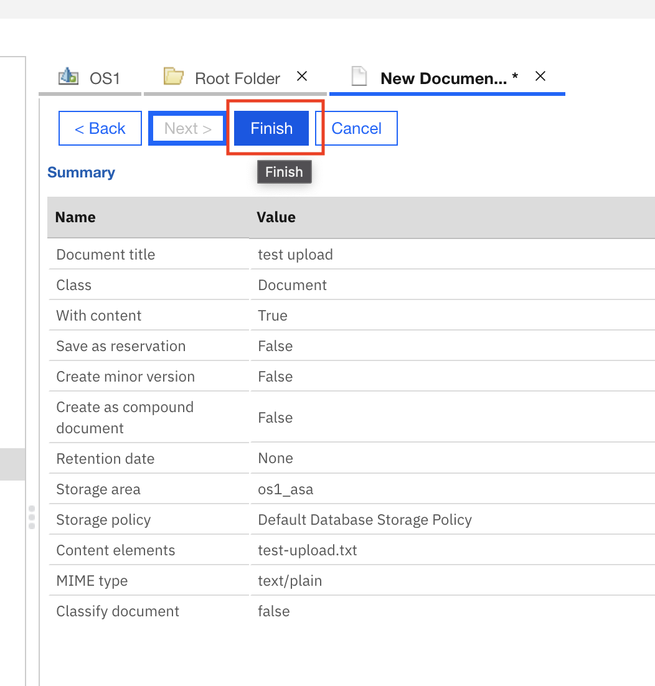
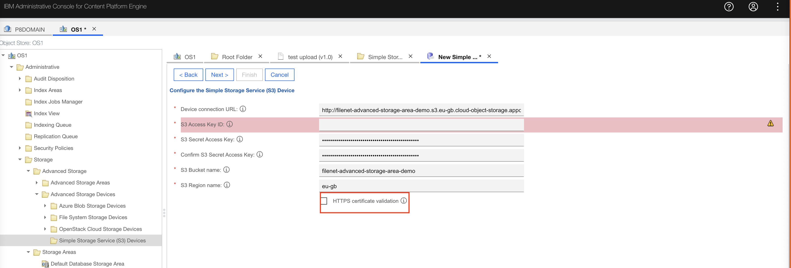
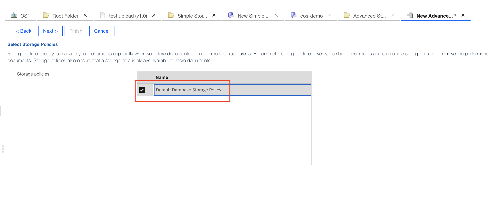

# Manually deploying a CP4BA CR

## Description

A custom resource is an object that extends the Kubernetes API or allows you to introduce your own API into a project or a cluster. It is within the CP4BA custom resource that a user defines the configuration of the FileNet instance.

- You can find more information about the configuration parameters used in the custom resource here: https://www.ibm.com/docs/en/cloud-paks/cp-biz-automation/19.0.x?topic=parameters-filenet-content-manager-operator-deployment

## Contents

- [Manually deploying a CP4BA CR](#manually-deploying-a-cp4ba-cr)
  - [Description](#description)
  - [Contents](#contents)
  - [Prerequisites](#prerequisites)
  - [Guide](#guide)
    - [Authenticating against OpenShift](#authenticating-against-openshift)
    - [Deploying the Custom Resource](#deploying-the-custom-resource)
    - [Monitoring the install](#monitoring-the-install)
      - [Monitor the operator logs](#monitor-the-operator-logs)
      - [Monitoring Custom Resource (CR) status](#monitoring-custom-resource-cr-status)
    - [Accessing the FileNet via the ACCE UI](#accessing-the-filenet-via-the-acce-ui)
  - [Confirming what has been deployed](#confirming-what-has-been-deployed)
    - [Creating your first FileNet Document from the ACCE UI](#creating-your-first-filenet-document-from-the-acce-ui)
      - [Creating a document on PVC Storage](#creating-a-document-on-pvc-storage)
      - [Creating a document on COS Storage](#creating-a-document-on-cos-storage)
  - [Contact](#contact)

## Prerequisites

- Completed all of the steps in the [CP4BA Install Guide](../1-cp4ba-install/README.md).
- COS bucket in IBM Cloud ([follow steps here](../4-administer-cp4ba-cicd#configuring-cos))

## Guide

> **The following steps in this guide assume that you have navigated to the `2-deploy-cp4ba` directory within this repo (the same directory this readme file is located).**

### Authenticating against OpenShift

1. Go to the IAM section in the top right corner of the UI, and select _Copy login command_.
2. Paste the command in your terminal and hit enter.
3. The command `oc whoami` will tell you how you're logged in.

### Deploying the Custom Resource

1. Set the project to cp4ba:

```bash
oc project cp4ba
```

2. Create the custom resource:

```bash
oc apply -n cp4ba -f ./custom-resource/22.0.1/22.0.1-cr-1-objstore.yaml
```

### Monitoring the install

The install will take up to **two hours** if starting from scratch.

#### Monitor the operator logs

1. You can monitor the install by tailing the content operator logs

```bash
oc logs -n cp4ba -l name=ibm-content-operator -f
```

#### Monitoring Custom Resource (CR) status

1. Head to `Operators > Installed Operators > IBM CP4BA FileNet Content Manager` and select the `CP4BA FileNet Content Manager Deployment` tab.

2. Make sure your project is set to `cp4ba` in the top left corner and click on your `icp4adeploy` CR.

3. On this page, the `Details` page will give you an overview of how your CR is configured.

4. Selecting the `YAML` tab and scrolling down to `status` will:

- Show you the install status of each CP4BA component you are deploying (e.g. succeeded / failed)
- Show you logs of some failed operator tasks

5. You will know your install has completed successfully when the following block appears in the YAML status of your CR:

```YAML
  conditions:
    - message: Running reconciliation
      reason: Running
      status: 'True'
      type: Running
    - message: ''
      reason: Successful
      status: 'True'
      type: Ready
```

### Accessing the FileNet via the ACCE UI

1. Once the install has completed, the content operator will generate a ConfigMap outlining endpoints for the CP4BA services deployed:

```bash
oc get cm icp4adeploy-cp4ba-access-info -o yaml
```

2. Under `cpe-access-info` open the `Content Platform Engine administration` URL in your browser.

- You will need to select `Enterprise LDAP` on the log in page
- Use the credentials configured in your OpenLDAP server.

3. Under `graphql-access-info` you can access the GraphQL Playground. Copy and past the below json into the playground to get the list of deployed Object Stores.

```
{
  domain {
    id
    objectStores {
      objectStores {
        id
        displayName
      }
    }
  }
}

```

## Confirming what has been deployed

1. Go to `Operators > Installed Operators > IBM CP4BA FileNet Content Manager > All Instances > icp4adeploy`

- Here you can see the CustomResource for FileNet that has been deployed aswell as how it has been configured.

2. Go to `Workloads > Deployments` and search for `icp4adeploy-cpe-deploy`.

3. Click `icp4adeploy-cpe-deploy`

- Here you can see that this deployment is managed by our FileNet CustomResource and the Pods that it is deploying.

### Creating your first FileNet Document from the ACCE UI

#### Creating a document on PVC Storage

1. From the Acce UI, select Object Store `OS1`, click the `Browse` folder and double-click `Root Folder`. Select the top `Actions` dropdown and select `New Document`:


2. Give your document a name. Make sure you leave `With content` ticked, then click `Next`:


3. Select `Add` to upload a file to your Document:


4. Click `Browse` to select a document from your filesystem and click `Add Content`, then click `Next`:


5. Leave the next 3 sections, (`Object Properties`, `Document Content and Version` and `Specify Settings for Retaining Objects` to their default value, click `Next`.

6. On the `Advanced Features` page, set the Storage Area to `os1_asa`, click `Next`:


> The `os1_asa` Storage Area has been pre-configured in our custom resource to store documents on a PVC mounted to the `cpe-deploy` FileNet pod.

7. Click `Finish` to create the Document:



8. You can find the new document back in `Root Folder`. Click on it and select `Actions > View/Download`:


9. Open your terminal, make sure you are logged into your CP4BA cluster, and run the following command to open a terminal on the FileNet CPE pod:

```bash
oc exec -it $(oc get pod -n cp4ba -l app=icp4adeploy-cpe-deploy -o jsonpath='{..name}') -- /bin/bash
```

10. From the CPE pod, run the following command to get to the Storage Area path:

```bash
cd /opt/ibm/asa/os1_storagearea1/
```

> This path matches [this line in out CR](./custom-resource/22.0.1/22.0.1-cr-1-objstore.yaml#L147)

11. Run the following command to see all documents uploaded on this Storage Area:

```bash
find /opt/ibm/asa/os1_storagearea1 -name "*"  -type f  -exec ls -lah {} \;
```

It should return something like:

```bash
bash-4.4$ find /opt/ibm/asa/os1_storagearea1 -name "*"  -type f  -exec ls -lah {} \;

-rw-r-----. 1 1000630000 root 14 Aug 12 15:44 /opt/ibm/asa/os1_storagearea1/content/35/42/40BA9282-0000-C53D-8356-F4E15C6E2FED
```

> This GUID represents the uploaded document. The upload time will match the upload time from the UI. The file will have been compressed by FileNet.

12. Back on the OpenShift console, navigate to `Workloads > Pods` and search for the `cpe-deploy` pod. Click on it and scroll down to `Volumes`. Look for a `file-stor` volume:


Documents stored in the Advanced Storage Area are persisted using a `PersistentVolumeClaim` named `icp4adeploy-cpe-deploy`. This means that:

- The stored documents will persist if the pod is deleted
- More than one CPE pod will be able to mount and read from that volume.

> Try deleting the `cpe-deploy` pod. You will see the Deployment recreate a new `cpe-deploy` pod with a slightly different name and new IP address, but with the same `icp4adeploy-cpe-deploy` `PersistentVolumeClaim`. Repeat steps 9-11 in this guide to check that the documents are still there (or check they are still available from the ACCE UI),

#### Creating a document on COS Storage

FileNet can store documents in a large number of Object Storage services. This guide will walk you through how to integrate FileNet with Cloud Object Store (COS).

1. From the Acce UI, select `OS1 > Storage > Advanced Storage Devices > Simple Storage Service (S3) Devices`, click `New` and you will land on this screen. Give your new Storage device a name and click next:


2. Configure the S3 Storage Device using your COS bucket credentials. For this demo, untick `HTTPS Certificate Validation`. Click `Next`:



3. Click `Finish` to create the S3 Storage Device

4. Find the new S3 Storage Device under `OS1 > Storage > Advanced Storage Devices > Simple Storage Service (S3) Devices`:


5. From the Acce UI, select `OS1 > Storage > Advanced Storage > Advanced Storage Areas` and click `New`:


6. Give the Advanced Storage Area a name and click `Next`. On the next screen, link the Advanced Storage Area to the S3 Storage device created in the previous step. Make sure to set the `Required synchronous devices` to `1`, click next:


7. Set the `Storage Policy` to `Default Database Storage Policy`, click `Next`:



8. Select `Finish` to create the new Advanced Storage Area.

9. From IBM cloud, open your COS bucket and make sure it is empty:


10. From the Acce UI, select Object Store `OS1`, click the `Browse` folder and double-click `Root Folder`. You will see any documents created in this folder. Select the top `Actions` dropdown and select `New Document`:


11. Give your document a name. Make sure you leave `With content` ticked, then click `Next`:


12. Select `Add` to upload a file to your Document:


13. Click `Browse` to select a document from your filesystem and click `Add Content`, then click `Next`:


14. Leave the next 3 sections, (`Object Properties`, `Document Content and Version` and `Specify Settings for Retaining Objects` to their default value, click `Next`.

15. Set the Storage Area to the `Advanced Storage Area` created in steps 6-9 (pointing to COS), click `Next`:


16. Select `Finish` to create the document

17. Back in IBM Cloud, refresh the COS bucket. You should see your document:


> `IBMContentManagerDevice.txt` is created by FileNet when you first create an Advanced storage Device. The long GUID is used by FileNet to uniquely identify your document.
